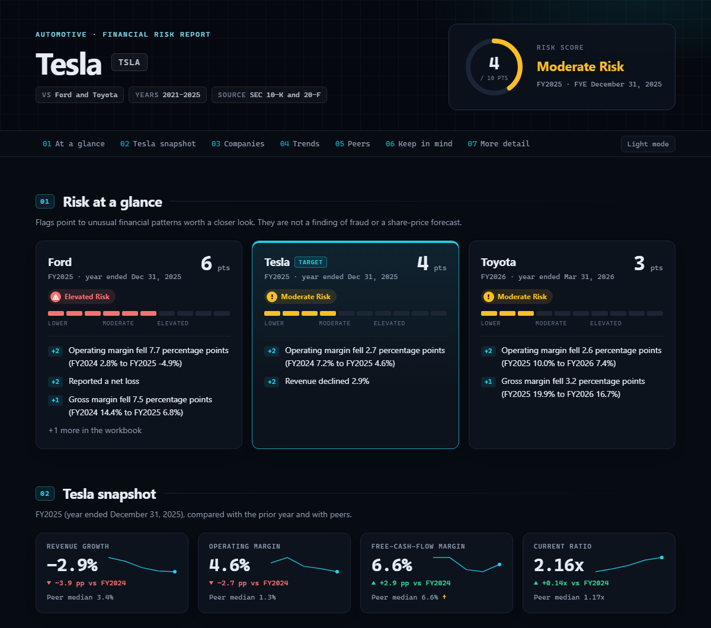

# Financial Risk & Peer Analysis

Compare a company with its industry peers using the annual reports they file with the SEC. The tool pulls the
financial statements, puts U.S. GAAP and IFRS filers on the same footing, calculates key ratios, and flags
unusual trends with a **transparent, point-based risk score**. Every point is traced to a named accounting rule.



> This is a screening tool. It points to patterns worth a closer look; it does not detect fraud or predict share prices.

## Quick start

Requires **Python 3.9 or newer**. The setup script finds a suitable Python (even if an older one is the
default), installs everything into a private `.venv` folder, and only needs to run once:

| | Windows | macOS / Linux |
|---|---|---|
| One-time setup | `setup.bat` | `./setup.sh` |
| Start the program | `run.bat` | `./run.sh` |

In PowerShell (the default terminal in PyCharm and VS Code on Windows), put `.\` in front: `.\setup.bat` and `.\run.bat`. A bare `run.bat` fails with "not recognized as the name of a cmdlet". In Command Prompt, the bare name works.

Prefer doing it by hand? `pip install -r requirements.txt`, then `python main.py`.

The guided setup asks four questions. Press Enter to accept each default:

```
Step 1 of 4 - Industry            Automotive, Retail, Technology, Pharmaceuticals, Apparel & Footwear,
                                  Consumer Goods, or Other (any company)
Step 2 of 4 - Company             1. Tesla  2. Ford  3. Toyota  4. General Motors ...
Step 3 of 4 - Compare with        Ford, Toyota, General Motors (pick several, or type any name or ticker)
Step 4 of 4 - Years               2021-2025
```

With **Other**, Step 3 suggests the largest companies that share your company's SEC industry code (the
first lookup for an industry takes up to a minute, then it is cached).

You can type any company by name (`Nike`) or ticker (`NKE`). **Only companies that file annual reports with the
SEC (10-K or 20-F) can be analyzed.** Many non-US companies, such as Adidas, Puma, Nestlé and BMW, file only in
their home country and are not available. If a name isn't found, try the ticker symbol.

The ratios are built for companies that make or sell things. **Banks, insurers and real-estate companies** report
very differently (no gross margin or current ratio, cash flow driven by lending and trading), so the report warns
that their scores are unreliable.

After you pick the peers, a **peer check** shows each company's SEC industry classification (SIC code) and
fiscal year-end, marks peers from a different industry, and explains what the peer group means for scoring:

```
Peer check (SEC industry codes)
        Tesla *   Motor Vehicles & Passenger Car Bodies (SIC 3711) - year ends Dec 31
  [ok]  Ford      same industry as Tesla (SIC 3711) - year ends Dec 31
  [!]   Walmart   different sector: Retail-Variety Stores - year ends Jan 31
  Note: Walmart is classified as Retail-Variety Stores by the SEC, not Motor Vehicles & Passenger Car Bodies...
Some peers are in a different industry. Continue with them anyway? (y/N)
```

Pick three or more peers from the same industry to let the peer-median rules add points.

Or skip the questions:

```bash
python main.py --industry automotive --target Tesla --peers Ford Toyota --years 2021-2025 --open
.\run.bat --industry pharmaceuticals --target Pfizer --peers Merck "Eli Lilly" AbbVie --years 2021-2025
```

Optional but recommended: identify yourself to SEC EDGAR. The program works without this, but it then sends a shared placeholder name. The SEC can slow down or block anonymous traffic, and a block on the placeholder would hit everyone using it. To use your own name and email, enter this before running:

| Shell | Command |
|---|---|
| PowerShell (Windows default) | `$env:SEC_USER_AGENT = "Your Name you@example.com"` |
| Command Prompt | `set SEC_USER_AGENT=Your Name you@example.com` |
| macOS / Linux | `export SEC_USER_AGENT="Your Name you@example.com"` |

Downloads are cached in `.cache/`, so a second run of the same companies is fast and works offline.

## What you get

Each run creates one folder in `output/`:

| File | What it is |
|---|---|
| `summary.html` | **Start here.** One page: risk level per company, company size, key charts (including revenue and net income in USD), peer table |
| `financial_report.xlsx` | Full workbook: peer comparison, trends, every rule result, data lineage, methodology |
| `cleaned_financial_data.csv` | Standardized financial statements for all companies and years |
| `charts/` | Trend charts (PNG) |
| `data/` | Metrics, rule results and explanatory events as CSV |

## How it works

1. **Download.** Reads 10-K / 20-F XBRL data from SEC EDGAR (cached locally in `.cache/`).
2. **Standardize.** Matches different accounting labels (e.g. Toyota's IFRS concepts in yen), keeps each company's
   own fiscal-year label, and aligns peers by comparison year (Toyota FY2026, year ended March 31, 2026, sits
   alongside Ford's and Tesla's FY2025).
3. **Measure.** Revenue growth, margins, current ratio, liabilities-to-assets, ROA, asset turnover, free-cash-flow
   margin, capex intensity and cash conversion. Retail adds inventory tests.
4. **Score.** Rules such as *PROF-1 Operating margin decline (+2)* add points; 0-2 Lower, 3-5 Moderate, 6+ Elevated.
   Figures that are not comparable across business models (e.g. captive-finance leverage) are shown but not scored.
5. **Explain (optional).** Searches 8-K / 6-K filings for events such as impairments or restructurings that may
   explain big changes. This is context only; it never changes a score.

Full details: [docs/methodology.md](docs/methodology.md).

## Project layout

```
main.py                     entry point (python main.py)
financial_analyzer/
    cli.py                  guided command-line interface
    data/                   SEC downloads, XBRL parsing, FX rates, standardization
    analysis/               metrics, comparability checks, risk rules, pipeline
    reporting/              summary page, Excel workbook, charts
    events.py               optional SEC event context
tests/
    unit/                   fast, offline tests on synthetic filings
    integration/            checks against real SEC data (uses the local cache)
docs/                       methodology and images
```

## Development

```bash
pip install -r requirements-dev.txt
python -m pytest                    # all tests
python -m pytest -m "not integration"   # offline tests only
```

To add an industry, edit `financial_analyzer/analysis/industries.py`; to add or tune a rule, edit
`financial_analyzer/analysis/risk.py`.
