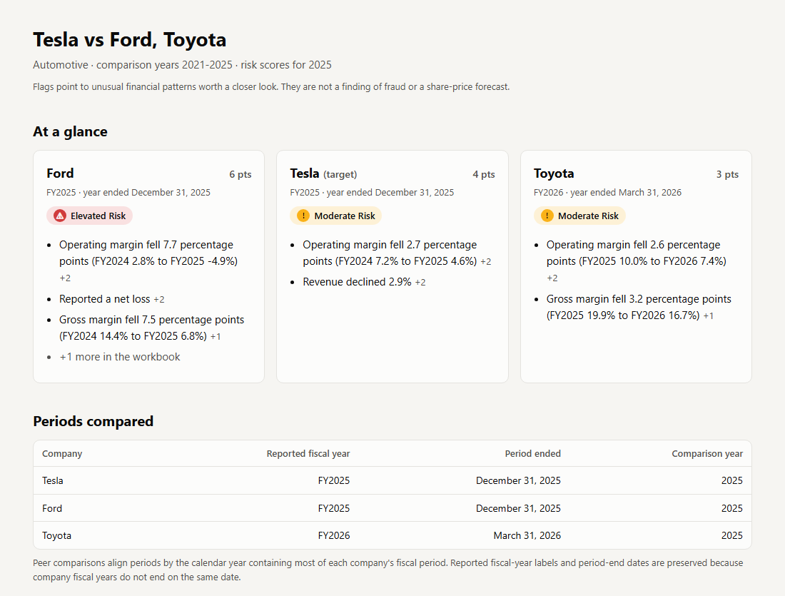

# Financial Risk & Peer Analysis

Compare a company with its industry peers using the annual reports they file with the SEC. The tool pulls the
financial statements, puts U.S. GAAP and IFRS filers on the same footing, calculates key ratios, and flags
unusual trends with a **transparent, point-based risk score**. Every point is traced to a named accounting rule.



> This is a screening tool. It points to patterns worth a closer look; it does not detect fraud or predict share prices.

## Quick start

```bash
pip install -r requirements.txt
python main.py
```

The guided setup asks four questions. Press Enter to accept each default:

```
Step 1 of 4 - Industry            1. Automotive  2. Retail  3. Other
Step 2 of 4 - Company             1. Tesla  2. Ford  3. Toyota  4. General Motors ...
Step 3 of 4 - Compare with        Ford, Toyota (pick several, or type any ticker)
Step 4 of 4 - Years               2021-2025
```

Or skip the questions:

```bash
python main.py --industry automotive --target Tesla --peers Ford Toyota --years 2021-2025 --open
```

Please identify yourself to SEC EDGAR, as its fair-access policy asks:
`set SEC_USER_AGENT=Your Name you@example.com` (Windows) or `export SEC_USER_AGENT=...` (macOS/Linux).

## What you get

Each run creates one folder in `output/`:

| File | What it is |
|---|---|
| `summary.html` | **Start here.** One page: risk level per company, periods compared, key charts, peer table |
| `financial_report.xlsx` | Full workbook: peer comparison, trends, every rule result, data lineage, methodology |
| `cleaned_financial_data.csv` | Standardized financial statements for all companies and years |
| `charts/` | Trend charts (PNG) |
| `data/` | Metrics, rule results and explanatory events as CSV |

## How it works

1. **Download.** Reads 10-K / 20-F XBRL data from SEC EDGAR (cached locally in `.cache/`).
2. **Standardize.** Matches different accounting labels (e.g. Toyota's IFRS concepts in yen), keeps each company's
   own fiscal-year label, and aligns peers by comparison year (Toyota FY2026, year ended March 31, 2026, sits
   alongside Ford's and Tesla's FY2025).
3. **Measure.** Revenue growth, margins, current ratio, liabilities-to-assets, ROA, asset turnover, free-cash-flow
   margin, capex intensity and cash conversion. Retail adds inventory tests.
4. **Score.** Rules such as *PROF-1 Operating margin decline (+2)* add points; 0-2 Lower, 3-5 Moderate, 6+ Elevated.
   Figures that are not comparable across business models (e.g. captive-finance leverage) are shown but not scored.
5. **Explain (optional).** Searches 8-K / 6-K filings for events such as impairments or restructurings that may
   explain big changes. This is context only; it never changes a score.

Full details: [docs/methodology.md](docs/methodology.md).

## Project layout

```
main.py                     entry point (python main.py)
financial_analyzer/
    cli.py                  guided command-line interface
    data/                   SEC downloads, XBRL parsing, FX rates, standardization
    analysis/               metrics, comparability checks, risk rules, pipeline
    reporting/              summary page, Excel workbook, charts
    events.py               optional SEC event context
tests/
    unit/                   fast, offline tests on synthetic filings
    integration/            checks against real SEC data (uses the local cache)
docs/                       methodology and images
```

## Development

```bash
pip install -r requirements-dev.txt
python -m pytest                    # all tests
python -m pytest -m "not integration"   # offline tests only
```

To add an industry, edit `financial_analyzer/analysis/industries.py`; to add or tune a rule, edit
`financial_analyzer/analysis/risk.py`.
